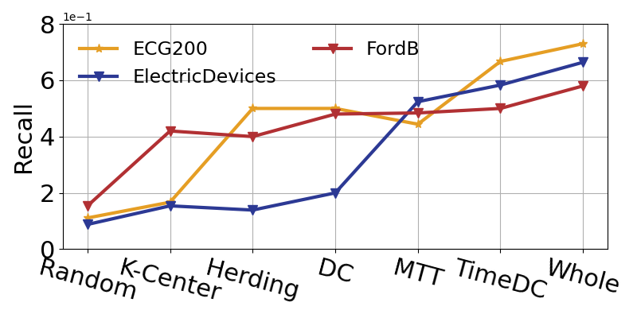

# Less is More: Efficient Time Series Dataset Condensation via Two-fold Modal Matching

## Running
- **Data Preparation:**
  - **Weather**, **Traffic**, **Electricity** and **ETT** can be downloaded from [Google Drive](https://drive.google.com/drive/folders/1ZOYpTUa82_jCcxIdTmyr0LXQfvaM9vIy).

- **Generating Expert Trajectories:**
  - Run each script in ```./scripts_buffer/``` to generate expert trajectories, for example
    ```
    sh ./scripts_buffer/weather.sh
    ```

- **Time Series Dataset Condensation with TimeDC**
  - After obtaining expert trajectories, run each script in ```./scripts_distill/``` to perform time series dataset condensation, for example
    ```
    sh ./scipts_distill/weather.sh
    ```

## Additional Experiments

<!-- ### Effect of the Number of Expert Trajectories-->

### Precisions on Time Series Classification
We also record the overall precision results on the task of time series classification. The results are as follows. TimeDC achieves the best performance among all the baselines. 




### Time Comparison Among Coreset Methods and TimeDC
We present the time of coreset construction and training time of coreset methods and TimeDC as follows, which shows the training time of TimeDC is comparable with those of coreset methods.

|            Dataset            | Weather |         |         |        |  ETTh1 |         |         |        |
|:-----------------------------:|:-------:|:-------:|:-------:|:------:|:------:|:-------:|:-------:|:------:|
|        Method (PL = 96)       |  Random | K-means | Herding | TimeDC | Random | K-means | Herding | TimeDC |
| Coreset Construction Time (s) |   1.85  |  10.14  |  63.66  |  None  |  2.00  |   6.07  |  69.01  |  None  |
|       Training Time (s)       |  20.37  |  20.40  |  20.38  |  20.41 |  9.54  |   9.56  |   9.55  |  9.56  |

## Requirements
```
python >= 3.8
Pytorch >= 1.11
Numpy
Pandas
```
